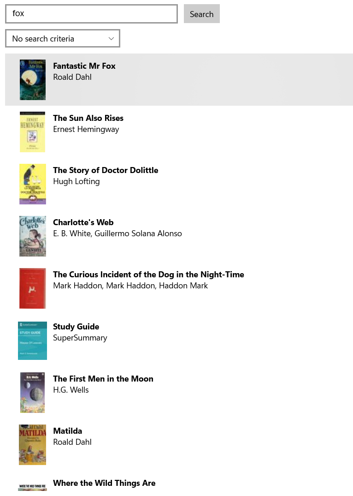
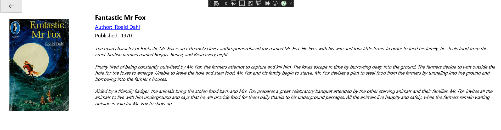
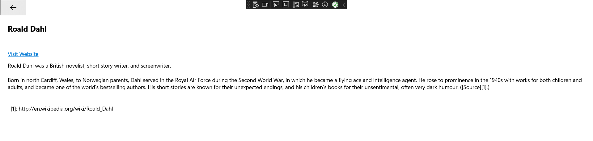

# Book Search Application

The Book Search application is designed to search for books using the Open Library API. Users can search by Title, Author, Subject, or with no selected criteria and receive matching results retrieved from the API. Clicking on a book from the search results will open a new window with more information about the book, including publishing date, description, and author’s name. Users can also view more details about the author, such as their date of birth, website link, and biography if available. The application also uses isolated storage to store the user’s search history, which is then used to reload previous results when returning to the Search Page. 

## Table of Contents
- [Introduction](#introduction)
- [Architecture](#architecture)
- [Class Design](#class-design)
- [API Logic](#api-logic)
- [API Call Example](#api-call-example)
- [Features](#features)
- [Technologies Used](#technologies-used)
- [Installation](#installation)
- [Usage](#usage)
- [Screenshots](#screenshots)
- [Documentation](#documentation)

## Introduction

The Book Search application is designed to search for books using the Open Library API. Users can search by Title, Author, Subject, or with no selected criteria and will be given the matching results retrieved from the API. Clicking on a book from the search results will open a new window with more information about the book, including publishing date, description, and author’s name. The author’s name can be clicked to view more details about the author, such as their date of birth, website link, and biography if they have one. The application also uses isolated storage to store the user’s search history. The search history is then used to reload previous results when returning to the Search Page. All the pages can be easily navigated between using back buttons.

## Architecture

This application is created using the MVVM design pattern, and the main components are separated into Views, ViewModels, Models, and Services.

- **Views**: Display the UI and trigger events in the ViewModels.
  - `SearchPage`: Allows the user to enter their text and criteria and then search for books accordingly.
  - `BookDetailsPage`: Displays more data about the book selected from the `SearchPage`.
  - `AuthorPage`: Displays more information about the author.
- **ViewModels**: Handle the logic and data-binding for each view.
  - `SearchPageViewModel`: Manages the `SearchPage` and calls methods to get books.
  - `BookDetailViewModel`: Manages the `BookDetailsPage` and extracts more information about the book.
  - `AuthorPageViewModel`: Manages the `AuthorPage` and retrieves more information about the author.
- **Models**: Define the data structure.
  - `BookModel`: Used to hold book information.
  - `AuthorModel`: Used to hold author information.
  - `SearchHistoryItemModel`: Used to store search history information.
- **Services**: Handle API communication.
  - `OpenLibraryService`: Executes API requests and returns data in the correct model format.

## Class Design

### Views
1. **SearchPage**
   - The loading page that allows users to search for books and displays results.
2. **BookDetailsPage**
   - Displays more detailed information about a selected book.
3. **AuthorPage**
   - Displays detailed information about an author.

### ViewModels
1. **SearchPageViewModel**
   - Manages and controls the `SearchPage`.
2. **BookDetailViewModel**
   - Manages and controls the `BookDetailsPage`.
3. **AuthorPageViewModel**
   - Manages and controls the `AuthorPage`.

### Models
1. **BookModel**
   - Defines the format for books.
2. **AuthorModel**
   - Defines the format for authors.
3. **SearchHistoryItemModel**
   - Stores information about search history.

### Services
- **OpenLibraryService**
  - Handles API communication and data retrieval.

## API Logic

All the ViewModels in this project rely on the `OpenLibraryService` class to facilitate communication between the UWP app and the Open Library API. The service can search for books, retrieve book descriptions, and get author details.

## Features
**Search Books:** Search for books by Title, Author, Subject, or no criteria.
**View Book Details:** Detailed information about selected books.
**View Author Details:** Information about authors including their biography and website links.
**Search History:** Store and reload previous search results.

## Technologies Used
**Front End and Logic:** UWP, C#
**Back End and Data Storage:** Open Library API, Isolated Storage

## Installation
1. Clone the repository: git clone https://github.com/JayWoodroffe/BookSearch.git
2. Open the project in Visual Studio.
3. Restore the NuGet packages.
4. Build and run the app.

## Usage
**Search Books:** Enter search criteria and view results.
**View Details:** Click on a book to see detailed information.
**Author Information:** Click on an author’s name to view their details.

## Screenshots
**Search Page**

**Book Details Page**

**Author Page**

## Documentation
For more detailed information, you can refer to the [Project Documentation](./docs/Documentation.pdf).
